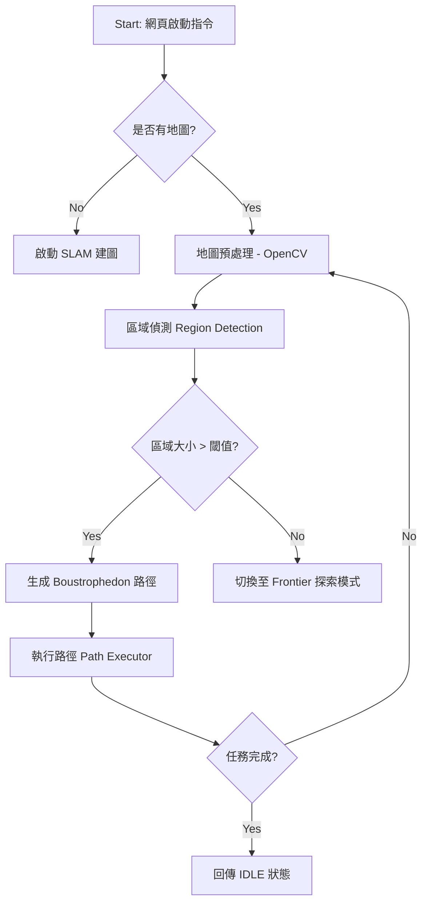

# 專案報告：TurtleBot3 全覆蓋路徑規劃 (CCPP) 整合系統

## 1. 專案背景與目標
在服務型機器人（如掃地機器人、巡檢機器人）的應用中，如何確保機器人能**完整走過區域內的每一個角落**（Complete Coverage Path Planning, CCPP）是核心挑戰。本專案透過 ROS Noetic 平台，在 TurtleBot3 機器人上實現了自動化的地圖建置與全覆蓋清掃任務。

## 2. 系統架構
本系統分為三個主要層級：
*   **感知與驅動層 (Hardware & SLAM)**：利用 TurtleBot3 LiDAR 進行 Gmapping 建圖。
*   **核心邏輯層 (CCPP Core)**：
    *   `ccpp_manager`: 管理系統狀態機。
    *   `region_detector`: 負責從地圖中分割出待清理的區塊。
    *   `coverage_planner`: 生成牛耕式掃描路徑。
*   **交互監控層 (Web UI)**：透過 `rosbridge_suite` 提供跨平台的即時監控畫面。

## 3. 核心流程圖 (Mermaid)

## 4. 關鍵技術：牛耕式演算法 (Boustrophedon Decomposition)
本專案採用的牛耕式演算法包含以下步驟：
1.  **座標對齊**：尋找待清掃區域的最長邊，並旋轉座標系使其與 X 軸平行，以減少轉向次數。
2.  **掃描生成**：根據機器人的 `robot_width` 與 `scan_overlap` 設定步進間距。
3.  **Zig-Zag 串接**：將掃描線的交點依序連接，形成連續的導航點序列。

## 5. 專題報告常見問題集 (Q&A)

### Q1: 機器人在覆蓋過程中遇到動態障礙物（如人走過）會如何反應？
**A:** 我們的系統並非直接傳送控制指令給輪子，而是將路徑點發送給 ROS 的 `move_base`。`move_base` 擁有本地規劃器 (Local Planner)，會根據即時 LiDAR 數據在地圖上進行避障，若障礙物消失，則會重新回到預定路徑。

### Q2: 如何定義「已覆蓋」與「未覆蓋」？
**A:** 我們在 `ccpp_manager` 中維護了一張 `coverage_map`。機器人走過的位置會在地圖影像中進行繪製 (Drawing)，透過將原始地圖與覆蓋地圖進行減法運算，即可精確計算出剩餘的「待清掃區域」。

### Q3: 為什麼路徑看起來有時不夠整齊？如何改進？
**A:** 目前系統偵測的是精細的「多邊形邊界」，這在複雜環境中會產生許多細碎的轉向點。為了讓路徑更易於觀察且更具商業價值，我們提出了「**區域矩形化處理 (Rectangle Simplification)**」的改進方案：利用 OpenCV 將待清理區域轉化為標準的方形（Bounding Box），這樣生成的牛耕式路徑會呈現極其規律的平行線條，大大提升了可視化的直觀性。

### Q3: 本系統的擴充性如何？
**A:** 系統採用模組化設計。若要更換機器人（如改用大型工業機器人），只需在 Launch 檔中修改 `robot_width` 參數；若要更換演算法，只需替換 `coverage_planner.py` 中的函數即可。

---

*(備註：本文件為大綱草稿，完整細節請參考 `生成專題報告的提示詞.md` 並配合 AI 工具生成更多文字敘述。)*
